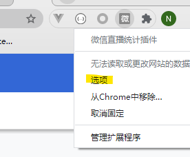

# 小程序直播的统计插件：

## 背景
    由于微信小程序直播的API接口，目前未开放接口进行数据获取，业务上需要统计数据，所以做了这个手工辅助获取直播官方的统计的chrome插件

## 使用方式：

    1- 在chrome 扩展中加载插件
    2- 启用插件，点击插件的option，并设置密匙和接受数据的地址
    3- 点击直播详情页面，打开后插件会自动拦截直播数据发送到配置的指定的url

​    

### 密匙的加解密：

    传输的密匙代码如下：
    let rand =  Math.random();
    let timestamp =   Date.now();
    let key = SHAkEY; // 配置的密匙
    let arr = [key, rand, timestamp]
    let signature = sha1.hex(arr.sort().join(""));
    console.log("signature",signature);
    
    $.ajax({
            url:`${RESTAPI}?rand=${rand}&timestamp=${timestamp}&signature=${signature}`,
    
            .... 省略
    
    }
    
    服务器端对照以上代码进行校验

### 如需更复杂的加解密，自行修改代码